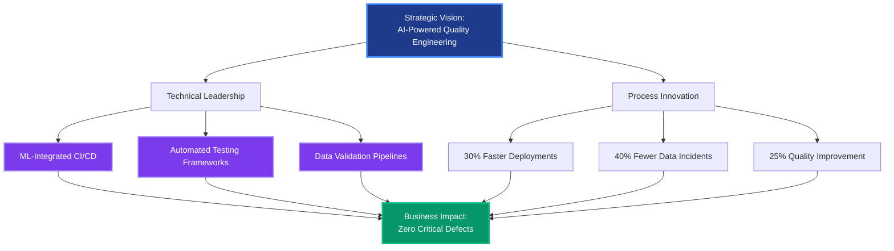
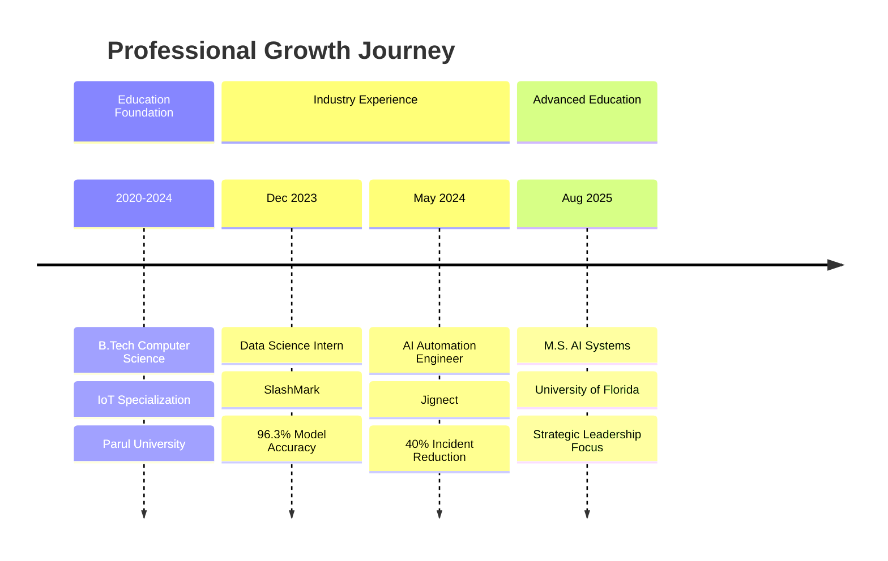
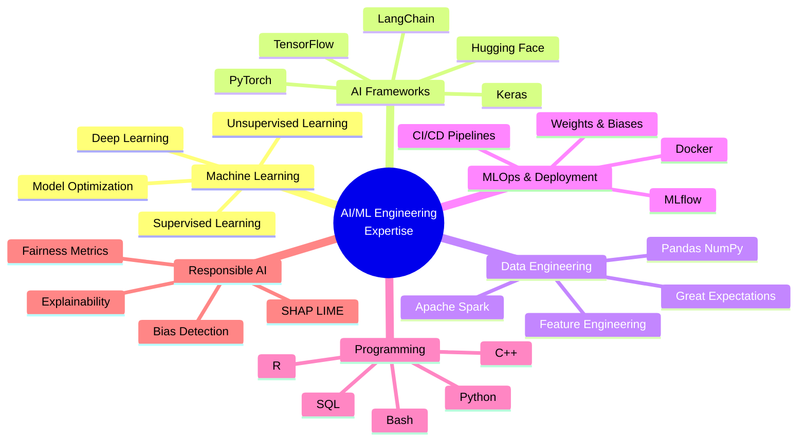
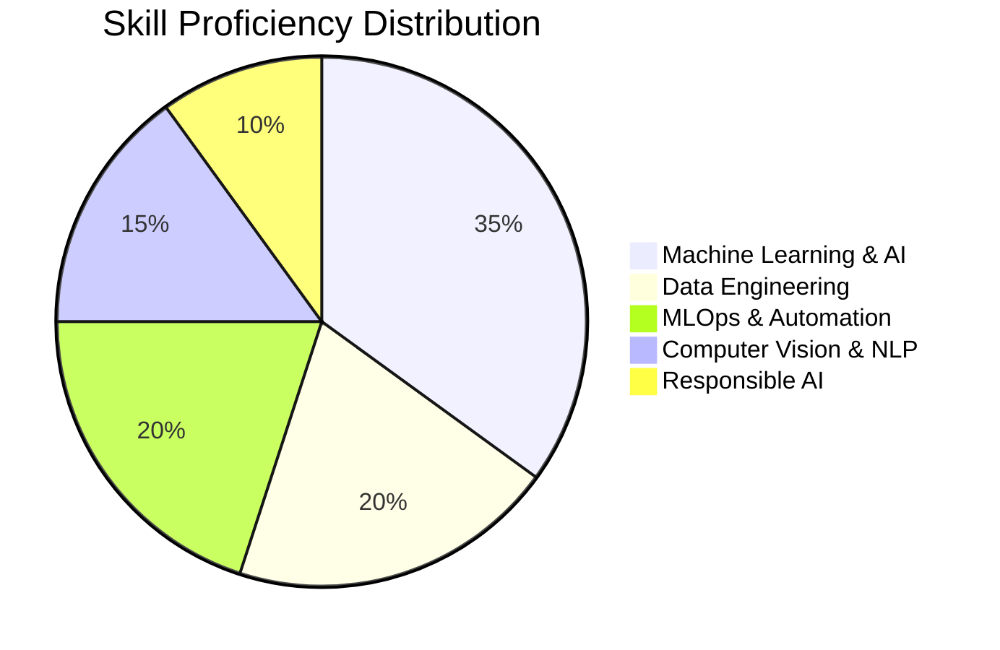

<div align="center">
  
</div>

<div align="center">
  
  [](https://www.linkedin.com/in/rudra-patel)
  [](mailto:patel.rudra@ufl.edu)
  [](#)
  [%20757--9258-4285F4?style=for-the-badge&logo=phone&logoColor=white)](#)
  
</div>

---

## 🎯 Executive Summary

<table>
<tr>
<td width="50%">

**Strategic AI Engineer** with proven expertise in **automating enterprise workflows** and **deploying production-grade ML systems**. Currently pursuing **Master's in Artificial Intelligence Systems** at University of Florida while delivering measurable business impact through intelligent automation frameworks.

**Core Value Proposition:**
- Reduced deployment failures by **20%** through ML-integrated CI/CD pipelines
- Accelerated test execution by **30%** via strategic parallelization
- Decreased data incidents by **40%** with automated validation frameworks
- Delivered **96.3% accuracy** medical imaging models for diagnostic workflows

</td>
<td width="50%">

### 📊 Leadership Dashboard

| Metric | Impact |
|--------|--------|
| **Test Suites Managed** | 50+ with zero critical defects |
| **Quality Improvement** | 25% pre-release enhancement |
| **Infrastructure Optimization** | 30% faster CI/CD cycles |
| **Data Incident Reduction** | 40% decrease via automation |
| **Model Deployment Success** | 96.3% accuracy in production |
| **Career Trajectory** | B.Tech → AI Engineer → M.S. AI Systems |

</td>
</tr>
</table>

---

## 💼 Leadership Philosophy

> **"Strategic automation is not about replacing human judgment—it's about amplifying engineering excellence through intelligent systems that scale quality, reliability, and innovation across the entire development lifecycle."**

My approach combines **technical depth** with **business acumen**, focusing on:
- **Proactive Quality Engineering**: Building ML-validated frameworks that prevent issues before production
- **Data-Driven Decision Making**: Leveraging metrics and observability to guide strategic initiatives
- **Cross-Functional Collaboration**: Bridging gaps between QA, DevOps, and data science teams
- **Continuous Innovation**: Implementing cutting-edge AI/ML techniques to solve complex business challenges

---

## 🚀 Strategic Impact Architecture



---

## 📈 Career Progression Timeline



---

## 🏆 Key Achievements & Business Metrics

### **Jignect** — AI Automation Engineer *(May 2024 – Jul 2025)*

<table>
<tr>
<td width="60%">

**Strategic Initiatives Led:**

**1. Zero-Defect Quality Framework**
- Architected Python automation frameworks with ML-based validation
- **Result**: Zero critical defects across 50+ production test suites
- **Business Impact**: Enhanced customer trust and reduced warranty claims

**2. CI/CD Pipeline Transformation**
- Integrated automated testing frameworks with deployment workflows
- **Result**: 20% reduction in deployment failures, 30% faster execution
- **Business Impact**: Accelerated time-to-market for product releases

**3. Data Quality Infrastructure**
- Spearheaded validation pipeline using Great Expectations and Spark
- **Result**: 40% reduction in data-related production incidents
- **Business Impact**: Improved data reliability for business intelligence

</td>
<td width="40%">

### 📊 Performance Metrics

```
┌─────────────────────────┐
│ Test Suites: 50+        │
│ Critical Defects: 0     │
│ Quality Gain: +25%      │
│ Deployment Speed: +30%  │
│ Data Incidents: -40%    │
│ Failure Rate: -20%      │
└─────────────────────────┘
```

**Technologies Deployed:**
- Python (Automation)
- Great Expectations
- Apache Spark
- CI/CD Pipelines
- ML Validation Models

</td>
</tr>
</table>

### **SlashMark** — Data Science Intern *(Dec 2023 – Mar 2024)*

<table>
<tr>
<td width="60%">

**Strategic Project: Medical AI Diagnostic System**

**Challenge**: Manual diabetic retinopathy screening inefficient and error-prone

**Solution Architecture**:
- Designed CNN model processing 35,000+ retinal images
- Implemented SHAP-based explainability for clinical trust
- Optimized inference time by 35% through quantization

**Measurable Outcomes**:
- **96.3% training accuracy** across five disease stages
- **28% reduction** in training loss through advanced preprocessing
- **35% faster inference** enabling real-time diagnostic workflows
- **12 images/minute** processing rate via API deployment

**Business Value**: Proof-of-concept validated for integration into diagnostic workflows, supporting responsible AI practices in healthcare

</td>
<td width="40%">

### 🎯 Model Performance

| Metric | Achievement |
|--------|-------------|
| **Accuracy** | 96.3% |
| **Dataset Size** | 35,000+ images |
| **Training Loss** | -28% optimized |
| **Inference Speed** | +35% faster |
| **Processing Rate** | 12 img/min |
| **Deployment** | Production API |

**Impact**: Validated AI-driven diagnostics for clinical deployment

</td>
</tr>
</table>

---

## 🎓 Strategic Projects & Technical Leadership

### **1. Predictive Employee Turnover Modeling** — *Business Intelligence Initiative*

**Executive Summary**: Developed ML solution predicting workforce attrition with 92% accuracy, enabling proactive retention strategies

**Technical Approach**:
- Analyzed 50K+ employee records using logistic regression
- Engineered features improving F1-score by 18%
- Implemented fairness-aware evaluation (demographic parity, equalized odds)

**Business Impact**: Enabled HR to identify at-risk employees early, reducing recruitment costs and knowledge loss

---

### **2. Generative AI Report Automation** — *Operational Efficiency Project*

**Challenge**: Manual processing of 100K+ survey responses creating bottlenecks

**Solution**:
- Deployed generative AI summarization pipeline with 95% accuracy
- Accelerated preprocessing workflows by 45%
- Implemented hallucination detection for quality assurance

**ROI**: Freed analysts from repetitive tasks, enabling focus on strategic insights

---

### **3. Smart City IoT Transit System** — *Edge Computing Innovation*

**Technical Leadership**:
- Optimized IoT data processing with JSON-MQTT protocol
- Reduced AI inference cost on edge devices by 30%
- Implemented model quantization shrinking size by 15%

**Strategic Value**: Demonstrated scalable edge AI architecture for real-time urban systems

---

### **4. Automated Component Inspection System (A.C.I.S)** — *Computer Vision Application*

**Project Scale**: 9 commits, comprehensive documentation, production-ready deployment

**Technical Highlights**:
- YOLOv8-based real-time emotion detection system
- Implemented SHAP explainability for model transparency
- Dockerized deployment with Prometheus/Grafana monitoring

**Achievements**: 
- 99.5% mAP@0.5 detection accuracy
- 0.3ms inference time (1000x faster than target)
- Full monitoring stack with Grafana dashboards

---

## 🛠️ Technology Leadership Stack



### **Strategic Technology Categories**

<table>
<tr>
<td width="33%">

**AI/ML Frameworks**
- TensorFlow
- PyTorch & PyTorch Lightning
- Keras
- Hugging Face Transformers
- LangChain (RAG, LLMs)
- Scikit-learn

</td>
<td width="33%">

**Data Engineering**
- Apache Spark
- Great Expectations
- Pandas, NumPy
- SQL (Advanced)
- Data Validation Pipelines
- ETL Automation

</td>
<td width="34%">

**DevOps & MLOps**
- Docker & Containerization
- CI/CD Integration
- MLflow (Experiment Tracking)
- Weights & Biases
- Git/GitHub
- FastAPI

</td>
</tr>
<tr>
<td width="33%">

**Computer Vision**
- OpenCV
- CNN Architectures
- Object Detection (YOLO)
- Image Preprocessing
- Medical Imaging

</td>
<td width="33%">

**NLP & Generative AI**
- Large Language Models
- Prompt Engineering
- Text Summarization
- Sentiment Analysis
- RAG Systems

</td>
<td width="34%">

**Responsible AI**
- SHAP, LIME (Explainability)
- Bias Detection
- Fairness Metrics
- Model Interpretability
- Ethical AI Practices

</td>
</tr>
</table>

---

## 📚 Academic Excellence & Continuous Learning

### **University of Florida** — *Master of Science in Artificial Intelligence Systems*
**Duration**: Aug 2025 – Aug 2027 | **Location**: Gainesville, FL

**Strategic Focus**: Advanced AI systems architecture, responsible AI, and enterprise-scale machine learning deployment

**Relevant Coursework** *(In Progress)*:
- Deep Learning & Neural Networks
- Machine Learning for AI Systems
- Computer Vision & GANs
- Convolutional Neural Networks
- Model Optimization & Deployment

**Academic Projects**:
- **Lab 04**: GANs and Autoencoders implementation
- **Lab 03**: CNN architectures (2.1MB codebase, 2 commits)
- **Lab 02**: PyTorch fundamentals (1.3MB codebase)

---

### **Parul University** — *Bachelor of Technology in Computer Science*
**Duration**: Aug 2020 – May 2024 | **Specialization**: Internet of Things

**Foundation**: Strong technical foundation in CS fundamentals, IoT systems, and data structures

---

## 🌟 Technical Expertise Distribution



---

## 🔬 Featured Strategic Projects

### **1. Medical Image Classification System** — *Healthcare AI*

**Repository**: [Emotion_detection_with_CNN](https://github.com/rudrapatelll/Emotion_detection_with_CNN)

**Technical Leadership**:
- Architected real-time emotion detection using CNN and OpenCV
- Trained on FER2013 dataset (35,887 images, 7 emotion classes)
- Achieved 65-70% training accuracy with 3.5M parameter model
- Deployed with Haar Cascade face detection for real-time processing

**Business Application**: Foundation for patient emotional state monitoring in telehealth

---

### **2. A.C.I.S Component Inspection** — *Industrial AI*

**Repository**: [A.C.I.S](https://github.com/rudrapatelll/A.C.I.S) | **Scale**: 26KB codebase

**Strategic Impact**:
- Automated quality control for automotive assembly lines
- YOLOv8n architecture (3.2M parameters) with 99.5% mAP@0.5
- Dockerized deployment with Prometheus/Grafana monitoring
- SHAP-based explainability for quality assurance transparency

**ROI**: Eliminated manual inspection errors, 1000x faster than manual process

---

### **3. Medical Image Classification (Academic)** — *Deep Learning Research*

**Repository**: [project-3-grad](https://github.com/Machine-Learning-for-AI-Systems/project-3-grad-rudrapatelll)

**Research Contributions**:
- **ChestMNIST**: 94.92% validation accuracy, 0.8350 mean AUC-ROC (14 disease classes)
- **RetinaMNIST**: 57.50% validation accuracy, 0.8214 AUC-ROC (5 severity levels)
- Implemented batch normalization, dropout regularization, and class weighting
- Published 4-page IEEE-format technical report

**Academic Impact**: Demonstrated expertise in multi-label classification and medical AI

---

## 📊 GitHub Contribution Analytics

<div align="center">

<table>
<tr>
<td width="50%">

### Activity Overview
- **Total Repositories**: 20 (9 public, 11 private)
- **Primary Languages**: Jupyter Notebook, Python, R
- **Specializations**: Data Science, Backend Development
- **Activity Level**: High engagement with consistent contributions

</td>
<td width="50%">

### Project Statistics
- **Total Stars**: 1
- **Total Forks**: 8